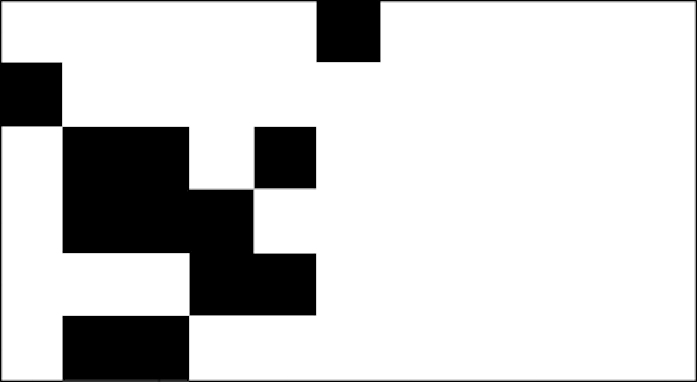
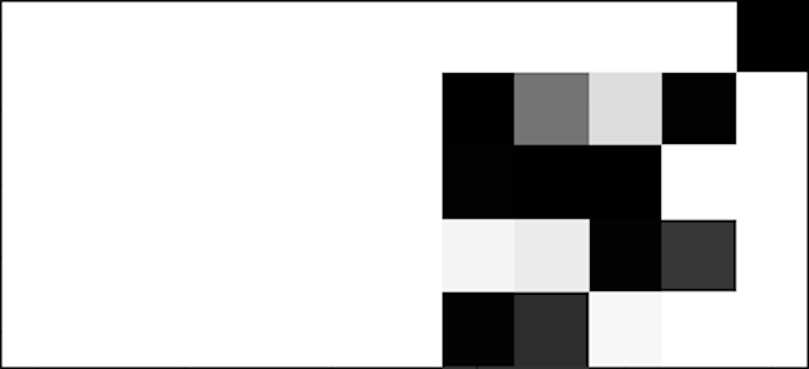

# NumPy-DNC

Pure NumPy based implementation of [Differentiable Neural Computer](https://www.nature.com/articles/nature20101) (DNC), intending to be read for understanding the architecture. In comparison to well developed deep learning frameworks, one of the advantages of reading through NumPy implementation is the explicit details of vectorizing computations to speed up training and inferencing. Operations are broken down according to corresponding subsections in the paper. 

## Code Structure

The code is currently structured as follows:

* `accessor.py` implements the writing and reading interactions with memory based on the emitted interface vector from the controller, as detailed in the **METHODS** section of the paper.
* `dnc_lstm.py` implements a DNC model with single layer LSTM controller.
* `dnc_ff.py` implements a DNC model with a feedforward controller.
* `util.py` includes a variety of helper functions.
* `unit_test.py` provides test cases to check against the correctness of each operation. Currently under active construction.
*  `Trainer.ipynb` intends to provide an example trainer for DNC with visualization of results. Currently under active construction.

The directory structure may subject to change after all the testings are completed. The code is Python 2.7.

## Setup

The project relies on the NumPy based autograd library (`pip install autograd`) for automatic differentiation during backprop.  In near future, I want to remove this dependency by backprop manually after making sure everything works as intended. I will also include instruction for manually deriving the gradients to provide more insights into the architecture.
Another long-term learning goal is to build my own automatic differentiation DAG constructor that can support this DNC.

## Differentiable Neural Computer
DNC belongs to the family of memory-augmented neural networks, which are designed to be able to represent variables and data structures. Results from the paper have shown the potential for DNC to solve complex and structured tasks that are difficult for neural networks without external memory. The predecessor of DNC is the Neural Turing Machine (NTM). The major difference between the two arise from the difference in access mechanism to interface with the memory matrix:
* NTM has no way to prevent overlapping or interference among allocated memory locations. The dynamic memory allocation mechanism allows DNC to avoid this problem.
* NTM cannot free used locations. DNC incorporates the free gates to address this problem.
* NTM can only preserve sequential information in contiguous memory. DNC specifically uses a temporal link matrix to track the order in which the writes were made, effectively decoupling sequential information and memory location.

### Tasks

Currently, only the copy task is implemented:

#### Copy

In this task,  a sequence of bit vectors is provided to the model. The input sequence starts with a reserved start vector, then some random binary bit vectors, followed by a reserved stop vector. The model is expected to start reproducing the exact input bit vectors immediately after observing the stop vector.

Input:
The first column of input is the reserved start vector, and the 6th column is the reserved stop vector for input

  

Target:
The last column is the reserved stop vector for output

  

Prediction after 20k iterations of training:

  

Ouput logits:

  

## TODOs
- [x] Complete unit tests and gradient checks for the model.
- [ ] Implement and benchmark tasks including repeated copy and graph tasks.
- [ ] Add manual backprop to double check the implementation and compare training speed with the autograd library.

## Notes & Observations
* Need to use slicing to implement cumulative product so that gradient can pass through.
* A small number (1e-20) needs to be added to the denominator of cosine similarity calculation to avoid dividing by zero. 
* Initial read vector, read weighting, write weighting, and usage vectors are currently initialized to a small number 1e-6. Will test out random initialization, as well as treating the initial values as learnable parameters.
* For content-based addressing with small word size and number of memory locations, np.einsum provides faster computation than np.inner.
* The diagonal of temporal linkage matrix should be set to 0 after each update.
* For allocation weighting, the order of calculation is based on usage vector with permutated index list using np.argsort. We thus need to apply inverse permutation before returning the resulting allocation weighting. To obtain the inverse permutation, we just need to apply np.argsort to the permutated index list.
* Calculation of usage is not differentiable with respect to write weights. May need to stop gradient to pass through write weights during backprop. Or alternatively, detach memory at each time step.
* Be careful when using the numerical gradient check in `unit_test.py`, multiple calls to a function may change its internal state multiple time in comparison to one pass with autodiff (i.e. `self.states.append(dict(zip(['u', 'ww', 'p', 'L', 'rw'],[u, ww, p, L, rw])))` in `accessor.py` breaks numerical gradient, must reinitialize accessor before each function evaluation in `unit_test.py`.
* For the copy task, the output emitted by the DNC when it is receiving input should not be penalized. Only output after receiving the reserved stop vector is used for loss calculation.
